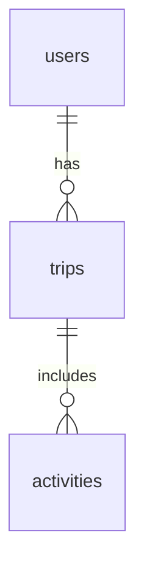

# Architecture Overview

This document outlines the high-level architecture of the **TravelGetaway** application, which uses a modern, containerized, microservices-oriented approach.

---

## System Components

The application is composed of three primary, containerized services:

- **Frontend (React/Next.js):**  
  A single-page application (SPA) that provides the user interface. Responsible for all rendering and user interaction. Communicates with the backend via a REST API.

- **Backend (Java/Spring Boot):**  
  A RESTful API server that handles all business logic, data processing, and user authentication. Exposes endpoints for the frontend to consume.

- **Database (MySQL):**  
  A relational database that provides persistent storage for all application data, including users, trips, and activities.

---

## Containerization with Docker Compose

All services are designed to run in isolated containers orchestrated by **Docker Compose**. This approach provides several key benefits:

- **Consistency:** Development, testing, and production environments are identical, reducing environment-specific bugs.
- **Isolation:** Services and their dependencies are isolated from the host machine and each other.
- **Portability:** The entire application stack can be easily run on any machine with Docker Desktop installed.
- **Scalability:** The containerized architecture allows for individual services to be scaled independently.

---

## Data Flow & Communication

1. The user interacts with the **Frontend** application in their browser.
2. The **Frontend** makes asynchronous HTTP requests (REST API calls) to the **Backend** to fetch or modify data.
3. The **Backend** processes these requests, containing the business logic for operations related to users, trips, and activities.
4. For data persistence, the **Backend** communicates with the **MySQL Database**, executing SQL queries to create, read, update, and delete records.
5. The **Backend** sends a response (typically in JSON format) back to the **Frontend**.
6. The **Frontend** updates the UI based on the response from the backend.

---

## Database Schema & Migrations

- The database schema is managed by **Flyway**, a database migration tool integrated into the Spring Boot application.
- SQL migration scripts are located in `backend/src/main/resources/db/migration`.
- When the backend service starts, Flyway automatically checks for new migration scripts and applies them to the database, ensuring the schema is always up-to-date.
- This automates schema changes and eliminates the need for manual SQL execution during deployment.

---

## Database Relationships

- **users** ⟶ **trips**: One-to-many  
  Each user can have multiple trips (`trips.user_id` references `users.id`).

- **trips** ⟶ **activities**: One-to-many  
  Each trip can have multiple activities (`activities.trip_id` references `trips.id`).

- **users** ⟶ **activities**: Indirect (through trips)

### Entity Relationship Diagram (ERD)

